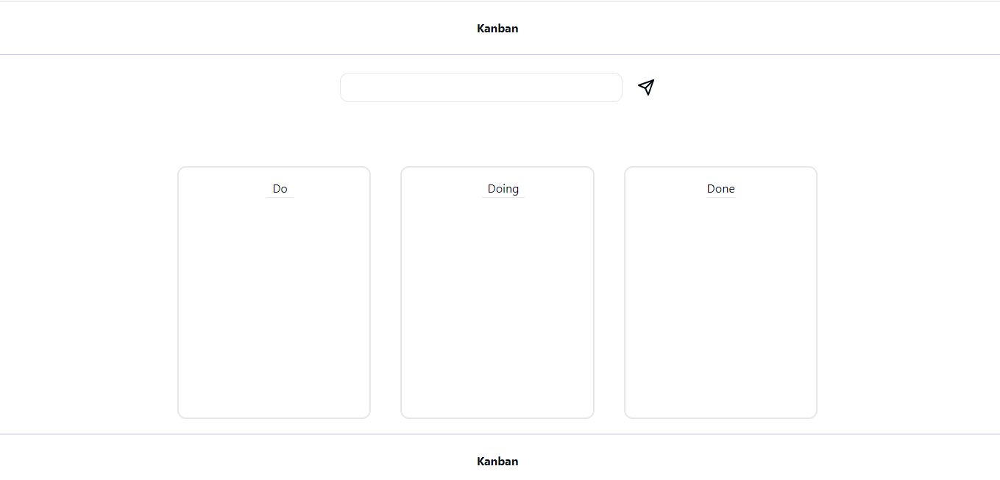

## Projeto Kanban - Fullstack

Este é um simples projeto Kanban Fullstack, tendo como funcionalidades: adicionar tarefas e mover tarefas entre Do, Doing e Done.

## Tecnologias utilizadas

**Front-end:** React.JS, Typescript, Tailwind.CSS

**Back-end:** Java Spring, Spring Web

